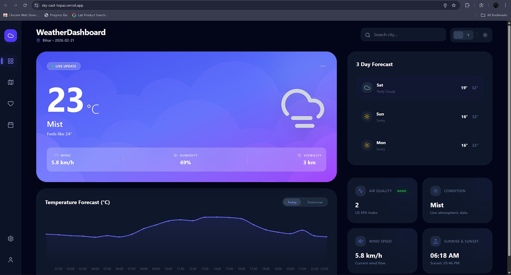
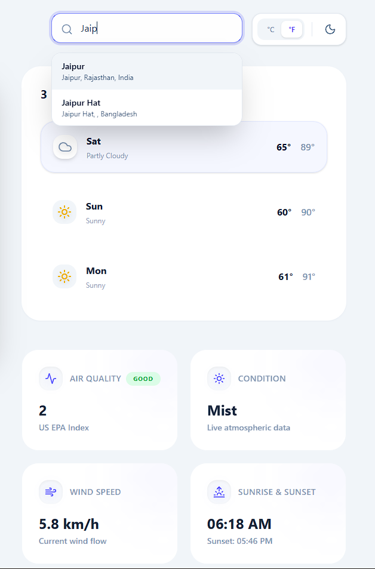
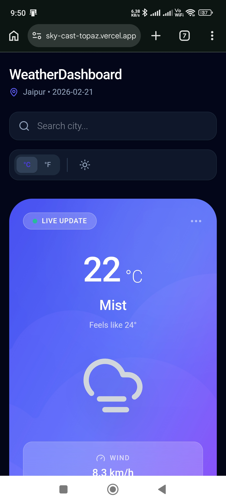

# 🌤️ SkyCast Modern Weather Forecast Web App


**SkyCast** is a modern, responsive, and visually rich weather forecast web application built using **React + Vite**. It provides real-time weather data, beautiful UI animations, and an intuitive user experience designed for speed and clarity.

🔗 **Live Demo:** [SkyCast Weather App](https://sky-cast-topaz.vercel.app/)

📂 **GitHub Repo:** [View Source Code](https://github.com/radaxsumit/sky_cast)

---

# ✨ Features

* 🌎 Real-time weather data
* 📍 Location-based weather detection
* 🎨 Beautiful modern UI with smooth animations
* ⚡ Fast performance with Vite
* 📱 Fully responsive (mobile, tablet, desktop)
* 🌤️ Dynamic weather visuals based on conditions
* 📊 Weather stats like temperature, humidity, wind speed
* 🌙 Clean and minimal design

---

# 🖼️ Screenshots

## Main Dashboard



## Weather Details



## Mobile View



---

# 🚀 Tech Stack

**Frontend**

* React.js
* Vite
* JavaScript (ES6+)
* CSS / Tailwind / Custom Styling

**API**

* OpenWeather API (or your weather API)

**Deployment**

* Vercel

---

# 📦 Installation

Clone the repository:

```bash
git clone https://github.com/yourusername/sky-cast.git
cd sky-cast
```

Install dependencies:

```bash
npm install
```

Run development server:

```bash
npm run dev
```

Build for production:

```bash
npm run build
```

---

# 🔑 Environment Variables

Create a `.env` file in root directory:

```env
VITE_WEATHER_API_KEY=your_api_key_here
```

---

# 📁 Project Structure

```
sky-cast/
│
├── public/
├── src/
│   ├── components/
│   ├── assets/
│   ├── App.jsx
│   └── main.jsx
│
├── screenshots/
├── package.json
└── README.md
```

---

# 🌐 Deployment

Deployed using **Vercel**

Steps:

1. Push code to GitHub
2. Connect repo to Vercel
3. Add environment variables
4. Deploy

---

# 🎯 Performance Highlights

* ⚡ Fast load time
* 📦 Optimized bundle
* 🎨 Smooth animations
* 📱 Fully responsive

---

# 👨‍💻 Author

**Summit Prajapati**

- GitHub: [radaxsumit](https://github.com/radaxsumit)
- LinkedIn: [Sumit Prajapati](https://www.linkedin.com/in/sumit-prajapati03/)

---

# ⭐ Support

If you like this project, please give it a ⭐ on GitHub!

---

# 📜 License

This project is licensed under the MIT License.

---

# 🔮 Future Improvements

* 7‑day forecast
* Hourly forecast
* Multiple city tracking
* Weather maps integration

---

**SkyCast — Weather, beautifully visualized.**
